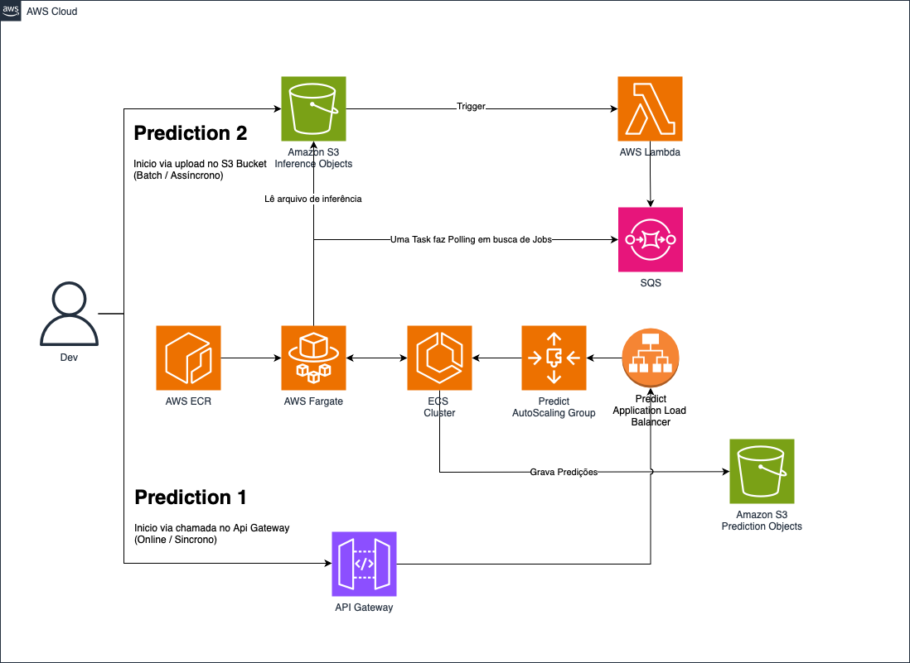
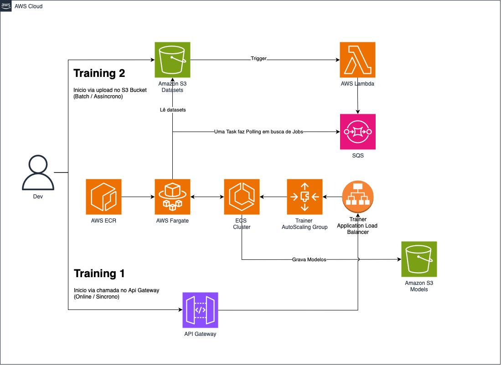

# Arquitetura de Predição e Treinamento de Modelos com AWS

### Arquitetura de Predição

### Arquitetura de Treinamento

---

## **Arquitetura de Predição**
A arquitetura de predição permite a execução de inferências de duas formas:
1. **Síncrona (Online) via API Gateway** - Respostas em tempo real.
2. **Assíncrona (Batch) via upload no S3** - Processamento em lote.

### **Fluxo de Execução**
#### **Prediction 1 (Síncrono / Online)**
- O **desenvolvedor** faz uma requisição à **API Gateway**.
- A API invoca uma **task no ECS Cluster** rodando em **AWS Fargate**.
- A task é executada dentro do **Predict AutoScaling Group**, garantindo escalabilidade automática conforme a demanda.
- As predições são processadas e armazenadas no **Amazon S3 Prediction Objects**.
- O resultado também é **retornado diretamente na resposta da API** para acesso imediato.
- Os resultados podem ser acessados via **Predict Application Load Balancer**.

#### **Prediction 2 (Assíncrono / Batch)**
- O usuário faz **upload de um arquivo de inferência** no **Amazon S3 Inference Objects**.
- Esse evento aciona um **AWS Lambda**, que publica um job na **fila SQS**.
- Uma **task no ECS Cluster** faz **polling na SQS** em busca de jobs a serem processados.
- O processamento ocorre dentro do **Predict AutoScaling Group**.
- O resultado final é armazenado no **Amazon S3 Prediction Objects** e pode ser acessado via **Predict Application Load Balancer** posteriormente.

---

## **Arquitetura de Treinamento**
A arquitetura de treinamento permite que novos modelos sejam treinados tanto **sob demanda (via API)** quanto **em lote (via S3)**.

### **Fluxo de Execução**
#### **Training 1 (Síncrono / Online)**
- O **desenvolvedor** faz uma chamada à **API Gateway**.
- A API aciona uma **task no ECS Cluster** rodando em **AWS Fargate**.
- O treinamento é executado dentro do **Trainer AutoScaling Group**.
- O modelo treinado é armazenado no **Amazon S3 Models**.
- O resultado do treinamento também é **retornado diretamente na resposta da API**.
- Os modelos podem ser acessados via **Trainer Application Load Balancer**.

#### **Training 2 (Assíncrono / Batch)**
- O usuário faz **upload de um dataset** no **Amazon S3 Datasets**.
- Esse evento aciona um **AWS Lambda**, que publica um job na **fila SQS**.
- Uma **task no ECS Cluster** faz **polling na SQS** em busca de jobs de treinamento.
- O treinamento ocorre dentro do **Trainer AutoScaling Group**.
- O modelo treinado é armazenado no **Amazon S3 Models** e pode ser acessado via **Trainer Application Load Balancer** posteriormente.

---

## **Detalhes Técnicos e Benefícios**

### **Armazenamento e Versionamento**
- Os buckets **Amazon S3 Prediction Objects** e **Amazon S3 Models** possuem **versionamento ativado**, garantindo rastreabilidade e recuperação de versões anteriores em caso de falhas.

### **Fila SQS para Garantia de Processamento**
- A **fila SQS** assegura que **todas as requisições batch serão processadas**.
- Caso o sistema esteja sobrecarregado, as mensagens permanecem na fila até serem consumidas.
- A combinação de **AWS Lambda + SQS** oferece um mecanismo confiável e escalável para processamento assíncrono.

### **Uso do ECS com AutoScaling Group e Fargate**
- **ECS com AutoScaling Group** garante **resiliência e alta disponibilidade**.
- **AWS Fargate** elimina a necessidade de gerenciar servidores, reduzindo **custos operacionais**.
- A **escalabilidade automática** otimiza os recursos de computação conforme a carga de trabalho.

### **API Gateway e Application Load Balancer**
- **API Gateway** oferece um ponto único de acesso para inferências e treinamentos síncronos.
- **Application Load Balancer** distribui as requisições de forma eficiente, garantindo **baixa latência e balanceamento de carga**.

---

## **Benefícios de Oferecer Modos Online e Batch**
### **1. Modo Online (API Gateway)**
✔ Ideal para casos onde a resposta precisa ser **instantânea**.
✔ Permite **integração direta com aplicações web e sistemas**.
✔ Utiliza **escalabilidade elástica** para suportar cargas variáveis.
✔ O resultado **é retornado diretamente na API**, permitindo acesso imediato.
✔ Melhor para **processamentos mais leves**, garantindo **baixa latência**.

### **2. Modo Batch (S3 + SQS)**
✔ Melhor para **processamento em larga escala**.
✔ Oferece **maior eficiência para grandes volumes de dados**.
✔ **Evita gargalos**, já que os jobs são processados conforme a capacidade disponível.
✔ O **uso da SQS** evita perda de jobs, garantindo **alta confiabilidade**.
✔ O desenvolvedor pode **consultar os resultados posteriormente** diretamente no **Amazon S3**, sem se preocupar com limites de tamanho na resposta da API.
✔ Ideal para **processamentos mais pesados**, onde não há necessidade de resposta imediata.

